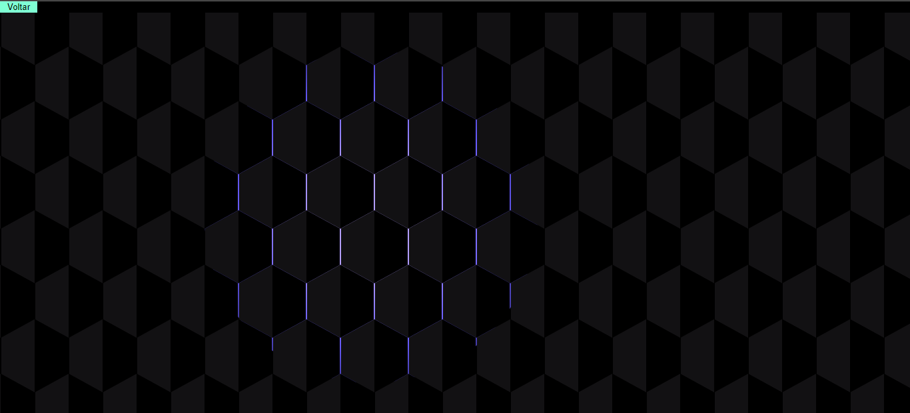

<h1>Página de efeitos css</h1>

Uma página focada em aplicações de efeitos css com algumas interatividades em algumas das opções, o projeto foi feito para ter uma prática melhor com css e alterando o código feito por outra pessoa sendo mais dinâmico e responsivo da melhor forma. 

<h2>Tecnologias usadas</h2>
<ul>
    <li>HTML</li>
    <li>CSS</li>
    <li>JS</li>
</ul>
 
<h2>Páginas e exemplo</h2>

tela de início é um exemplo de que o foco principal foi estilo

<ul>
    <li>
        <h3>Página Hexagon</h3>
        
        
Ao mover o mouse o fundo segue com uma cor de fundo próxima

    </li>
        <li>
        <h3>Página Vagalumes</h3>
        
        
Ao mover o mouse os pontos crescem formando pontos mais brilhantes

    </li>
        <li>
        <h3>Página Hexagon</h3>
        
        
São partículas que se movem na tela

    </li>
</ul>

<h2>Acesse pelo link https://angelo-spyder.github.io/Show-CSS/</h2>